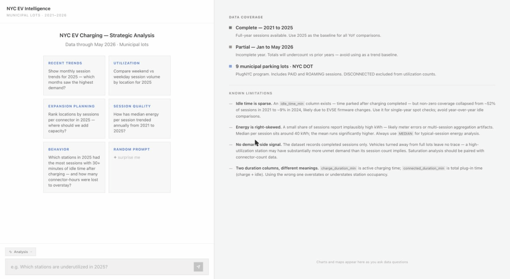
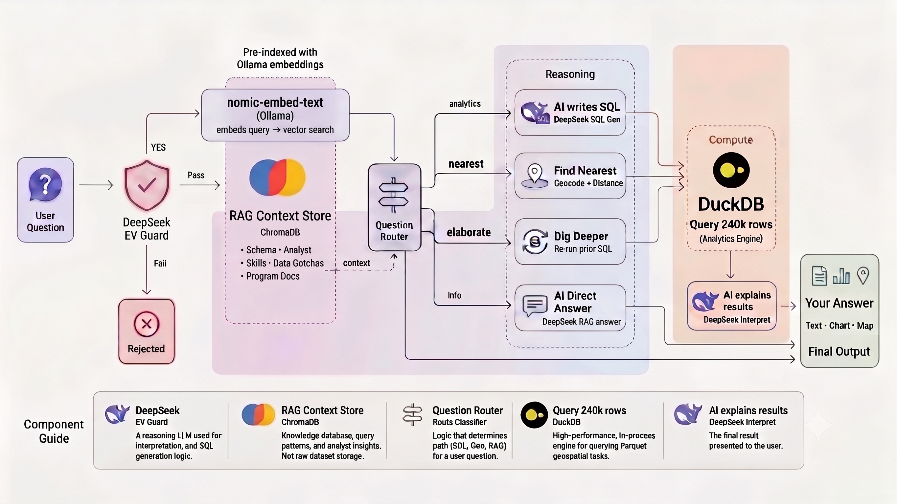
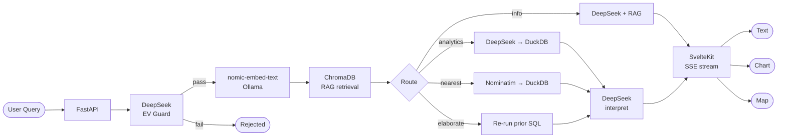

# RAG + SQL · NYC Municipal EV Charging Analytics

A conversational analytics chatbot over NYC's public EV charging dataset. Ask plain-English questions — the system routes them through a multi-step LLM pipeline, queries 240k+ sessions with DuckDB, and returns answers with interactive charts and maps.

Built as a portfolio demonstration of low-cost, open-source AI infrastructure.

---



---

## Reasoning Workflow



---

## Architecture



### Layer breakdown

**Frontend** — SvelteKit with Tailwind CSS v4. Streams SSE events from the backend and progressively renders thinking steps, the answer, and optional chart or map without a page reload.

**Routing** — A regex-based intent classifier dispatches each query to one of four handlers: analytics SQL, direct RAG answer, nearest-charger geocode, or elaboration of a prior result. The classifier runs client-side in Python before any LLM call, keeping latency low on simple paths.

**RAG** — ChromaDB stores embedded schema documentation and domain knowledge (analyst reasoning guidelines, data gotchas). On every request the top-k most relevant chunks are retrieved and injected into the LLM prompt, giving the model accurate column semantics without fine-tuning.

**SQL engine** — DuckDB queries the dataset directly from a local Parquet file. Vectorized column scans over 240k rows complete in milliseconds. The LLM generates SQL; on failure, a second LLM call auto-corrects the query before surfacing an error.

**LLM** — DeepSeek handles SQL generation, result interpretation, guard classification, and direct answers. Chosen for strong reasoning at a fraction of the cost of frontier models.

**Embeddings** — `nomic-embed-text` via Ollama runs entirely locally — no embedding API costs.

---

## Tech Stack

| Layer | Technology |
|---|---|
| Frontend | SvelteKit, Tailwind CSS v4, MapLibre GL |
| Backend | FastAPI (Python), SSE streaming |
| LLM | DeepSeek API |
| Vector store | ChromaDB (local, persistent) |
| Embeddings | Ollama · `nomic-embed-text` (local, free) |
| SQL engine | DuckDB (in-process, vectorized) |
| Data format | Parquet (Apache Arrow) |
| Charts | Plotly (LLM-generated Python, server-rendered to HTML) |
| Maps | MapLibre GL (static + animated time-series) |

---

## Cost & Design Philosophy

The stack is intentionally built to avoid managed-service lock-in and keep ongoing costs low:

- **ChromaDB** runs locally — no Pinecone or managed vector DB
- **Ollama + nomic-embed-text** handles embeddings on-device — no OpenAI Embeddings API
- **DuckDB** replaces a cloud data warehouse for this dataset scale
- **DeepSeek** is the only paid component — a capable reasoning model at low per-token cost

A monthly budget cap and per-IP rate limiting are built into the backend so demo exposure doesn't run up costs unintentionally.

---

## Data Source

**NYC EV Charging Sessions** — published by NYC Department of Transportation via NYC Open Data (Socrata dataset `kj7g-u4gp`). Covers 240k+ charging sessions across 9 municipal parking facilities from July 2021 through May 2026.

Data is fetched once via the ingest script, cleaned, and stored locally as Parquet. No live API dependency at query time.

---

## Local Setup

### Prerequisites

- Python 3.11+
- Node.js 18+
- [Ollama](https://ollama.com) installed and running
- A DeepSeek API key
- A Socrata app token (optional — unauthenticated works but is throttled)

### 1. Clone and configure

```bash
git clone https://github.com/CoderKola/rag-sql-nyc-ev-intelligence.git
cd rag-sql-nyc-ev-intelligence
cp .env.example .env
# edit .env — add DEEPSEEK_API_KEY and optionally SOCRATA_APP_TOKEN
```

### 2. Backend

```bash
python -m venv .venv
source .venv/bin/activate
pip install -r backend/requirements.txt
```

### 3. Pull the embedding model

```bash
ollama serve          # in a separate terminal, if not already running
ollama pull nomic-embed-text
```

### 4. Ingest the dataset

Fetches ~240k rows from NYC Open Data, cleans and saves as Parquet, then builds the ChromaDB schema index.

```bash
python scripts/ingest.py
```

### 5. Start the backend

```bash
uvicorn backend.main:app --reload
```

### 6. Start the frontend

```bash
cd frontend
npm install
npm run dev
```

Open [http://localhost:5177](http://localhost:5177).

---

## Example Questions

```
Which location had the most charging sessions in 2024?
Show me energy delivered by borough over time.
Find the nearest charger to Yankee Stadium.
What percentage of sessions are roaming vs paid?
Which stations have the highest idle time?
```
